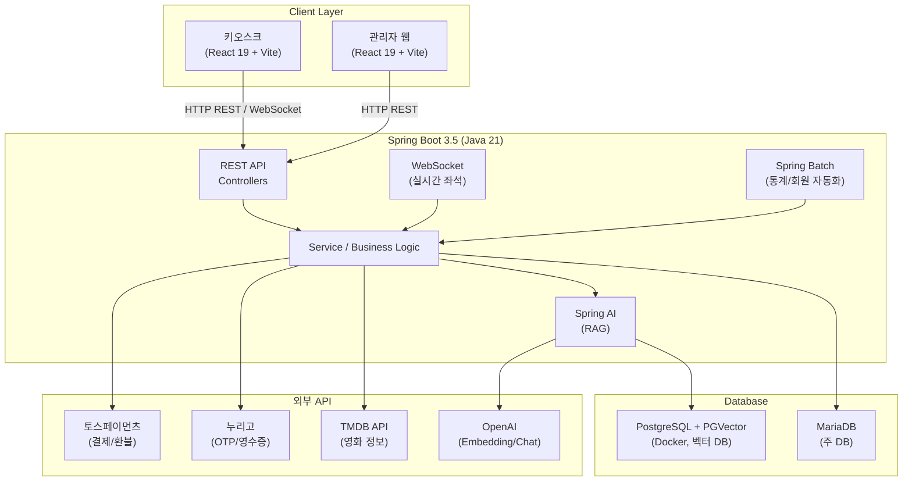
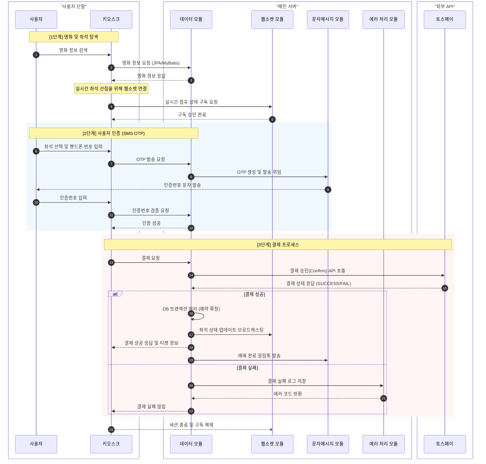
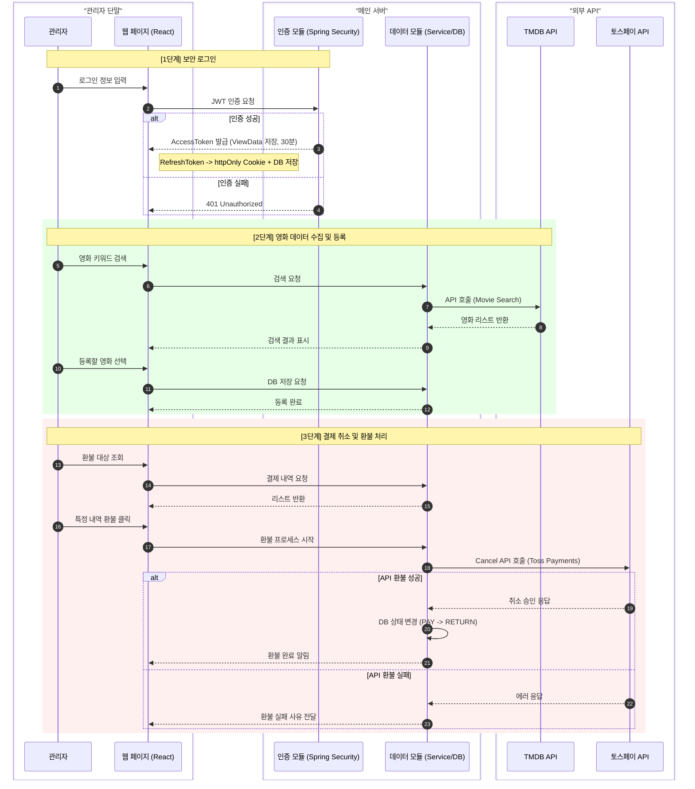

# cinemaKiosk 

[Front Git](https://github.com/Polaris6000/cineos_view)
> 영화관 무인 키오스크 풀스택 웹 애플리케이션


---

## 목차

- [팀원 소개](#팀원-소개)
- [프로젝트 소개](#프로젝트-소개)
- [빠른 시작 (Quick Start)](#빠른-시작-quick-start)
- [기술 의사결정](#기술-의사결정)
- [시스템 아키텍처](#시스템-아키텍처)
- [주요 기능](#주요-기능)
- [데이터베이스 설계](#데이터베이스-설계)
- [시퀀스 다이어그램](#시퀀스-다이어그램)
- [기술 스택](#기술-스택)
- [API 명세서](#api-명세서)
- [환경 변수 설정](#환경-변수-설정)
- [프로젝트 구조](#프로젝트-구조)
- [팀 문서](#팀-문서)
- [라이선스](#라이선스)

---

## 팀원 소개

| 팀원 이름    | 담당                                                                |
|----------|-------------------------------------------------------------------|
| 김준용 (팀장) | Spring AI(RAG, ETL, VectorDB, ChatMemory), <br/> Security, JPA 설계 |
| 최민종      | 스토리보드 작성, 프론트엔드 디자인, <br/> 프론트엔드 구현, API 명세서 작성                   |
| 강혜윰      | DB설계, WebSocket 구현, TossPG 구현,<br/> 백엔드 구조 설계                     |
| 조현재      | Spring Batch, TMDB API, 테스트 시트 작성                                 |

---

## 프로젝트 소개

### 시연 영상

| 소개 항목           | 비고                                                                                         |
|-----------------|--------------------------------------------------------------------------------------------|
| 고객 키오스크         | [영상보기](https://drive.google.com/file/d/1VpGzNeaiLbky4ta3t7FtR460js8s0EED/view?usp=sharing) |
| 관리자 키오스크 (TMDB) | [영상보기](https://drive.google.com/file/d/1mZ9L-dkJ7Ka2y7OLZofWKlWovzLeAIKo/view?usp=sharing) |
| WebSocket       | [영상보기](https://drive.google.com/file/d/1u0-D2g0aXrSReS_GWr-agdbG8Q2irdHR/view?usp=sharing) |
| SpringAI        | [영상보기](https://drive.google.com/file/d/1RgqCRZIE4g5f75HV8LsxYyz-PELut5lc/view?usp=sharing) |

### 만들게 된 이유

> 현대 사회의 흐름은 AI와 자동화를 통한 반복 노동의 최적화로 향하고 있습니다.
> 하지만 무인화 시스템이 고도화될수록, 하나의 한정된 자원에 다수의 사용자가 동시에 접근하며 발생할 수 있는 ‘실시간 데이터 무결성’이 시스템의 신뢰도를 결정짓는 핵심이라 생각했습니다. <br>
> 1초 미만의 짧은 찰나에 좌석 선점이 결정되는 예매 시스템은 다수 클라이언트 간의 즉각적인 데이터 동기화와 정교한 동시성 제어가 필수적입니다.
> 접근성과 친숙성을 고려했을 때, 해당 문제의 해결할 수 있는 형태가 '영화관 키오스크'라고 생각하여 프로젝트의 주제로 선정하였습니다.

### 프로젝트 개요

**cinemaKiosk**는 Spring Boot + React 기반의 영화관 무인 키오스크 풀스택 웹 애플리케이션입니다.

고객은 영화 조회 -> 스케줄 확인 -> 실시간 좌석 선택 -> SMS 본인인증 -> 토스페이먼츠 결제까지 하나의 흐름으로 예매를 완료할 수 있으며, 관리자는 별도 대시보드에서 영화 / 스케줄 / 정책 / 통계 등 전반적인
운영을
담당합니다.

Spring Batch를 통한 자동 통계 집계 및 회원 관리, Spring AI(RAG)를 통한 직원 교육용 AI 챗봇, WebSocket 기반 실시간 좌석 점유 기능을 포함합니다.

---

## 빠른 시작 (Quick Start)

### 사전 요구사항

| 항목      | 버전    | 비고                                                                                  |
|---------|-------|-------------------------------------------------------------------------------------|
| Java    | 21+   | [다운로드](https://adoptium.net/)                                                       |
| Node.js | 18+   | [다운로드](https://nodejs.org/)                                                         |
| MariaDB | 11.4+ | [다운로드](https://mariadb.org/download/)                                               |
| Docker  | 최신    | PostgreSQL + PGVector 실행용 / [다운로드](https://www.docker.com/products/docker-desktop/) |

### API 키 발급 (필수)

프로젝트 실행 전 아래 외부 서비스 키를 미리 발급받아 두세요.

| 서비스          | 발급 링크                                                                  | 용도               |
|--------------|------------------------------------------------------------------------|------------------|
| 토스페이먼츠       | [developers.tosspayments.com](https://developers.tosspayments.com/)    | 카드 결제 / 환불       |
| 누리고 (Solapi) | [solapi.com](https://solapi.com/)                                      | SMS OTP / 영수증 발송 |
| TMDB         | [themoviedb.org/settings/api](https://www.themoviedb.org/settings/api) | 영화 정보 조회         |
| OpenAI       | [platform.openai.com/api-keys](https://platform.openai.com/api-keys)   | 임베딩 / 챗봇         |

### 실행 순서

**1. 저장소 클론**

```bash
git clone https://github.com/your-username/cinemaKiosk.git
cd cinemaKiosk
```

**2. 데이터베이스 초기화** (필요하면 사용)

```bash
# MariaDB 스키마 및 초기 데이터 생성
mysql -u root -p < src/main/resources/DB/init.sql
mysql -u root -p cinema_kiosk < src/main/resources/DB/data.sql
```

**3. PostgreSQL + PGVector (Docker)**

```bash
docker run -d \
  --name pgvector \
  -e POSTGRES_PASSWORD=postgres \
  -p 5432:5432 \
  pgvector/pgvector:pg16
```

```bash
docker exec -it pgvector psql -U postgres
```

**데이터베이스 생성**

```postgresql
CREATE DATABASE rag;
```

**생성한 데이터베이스 선택**

```bash
\c rag
```

**PGVector Extension 설치**

```postgresql
CREATE EXTENSION IF NOT EXISTS vector;
```

**4. 환경 변수 설정**

```bash
cd cinemaKiOsk
cp .env.example .env
# .env 파일을 열어 발급받은 API 키들을 입력하세요
```

> `.env` 파일 작성 방법은 [환경 변수 설정](#환경-변수-설정) 섹션을 참고하세요.

**5. 백엔드 실행**

```bash
./gradlew bootRun
```

서버 기동 후 Swagger UI: `http://localhost:8080/swagger-ui/index.html`

**6. 프론트엔드 실행**

```bash
cd cineos_view
npm install
npm run dev
```

키오스크 / 관리자 UI: `http://localhost:5173`

---

## 기술 의사결정

프로젝트를 진행하며 내린 주요 기술 선택의 이유를 기록합니다.

### JPA + MyBatis 혼용

> 생산성과 기술적 성장을 위해 JPA를 도입하기로 결정했으나, 첫 도입인 만큼 숙련도 리스크와 현실적인 제약을 고려해야 했습니다. 기본적인 CRUD는 JPA로 신속하게 처리할 수 있었지만, 다중 테이블 조인이나
> 복잡한 집계 쿼리에서는 연관관계 설정과 제어의 어려움이 예상되었습니다.
>
> 따라서 복잡한 화면이나 대용량 조회에는 유지보수 효율성이 검증된 MyBatis를 혼용하는 하이브리드 전략을 선택하여, 기술적 리스크를 최소화하고 프로젝트의 안정성을 확보했습니다.

### WebSocket — Stomp 미사용

> 본 프로젝트는 단일 서버 구조이므로, 메시지 브로커나 STOMP 같은 상위 추상화 계층 없이 순수 웹소켓(Raw WebSocket)만으로도 안정적인 실시간 통신이 가능하다고 판단했습니다. 아키텍처를 단순화하여
> 프로토콜 오버헤드를 최소화하고, 단순한 좌석 선점 데이터 특성에 맞춰 커스텀 JSON 포맷을 적용함으로써 통신 비용을 절감했습니다.
>
> 더불어 프레임워크의 고수준 기능에 의존하기 전, 웹소켓의 핸드쉐이크부터 세션 관리까지의 전체 생명주기를 직접 제어하며 기본 구조를 깊이 이해하고자 했습니다. 이러한 로우 레벨에서의 경험이 향후 STOMP 등 상위
> 프로토콜을 정확히 응용할 수 있는 밑거름이 될 것입니다.

### JWT AccessToken / RefreshToken 이중 관리 구조

> JWT를 처음 접했을 때는 AccessToken과 RefreshToken을 같은 저장소에서 함께 관리하는 것으로 알고 있었습니다.
> 이번 프로젝트를 통해 AccessToken은 메모리(ViewData)에, RefreshToken은 httpOnly Cookie와 DB에 분리 저장하는 구조를 직접 구현하며 그 이유를 이해했습니다.
> AccessToken을 메모리에만 두면 XSS로 탈취되더라도 페이지 이탈 시 사라지고, RefreshToken을 DB에도 저장하면 서버 측에서 강제 만료가 가능해집니다.
<br><br>
> 자동 로그인 구현 시에도 새로운 점을 발견했습니다.
> 기존에 세션 방식으로 자동 로그인을 구현할 때는 UUID 값을 쿠키에 담아 서버의 세션과 대조하는 방식을 사용했는데,
> JWT에서는 RefreshToken 자체가 그 역할을 대신한다는 것을 이번에 처음 깨달았습니다.
> 일반 로그인과 자동 로그인의 차이를 RefreshToken 만료 기간(1일 vs 30일)으로만 구분하면 된다는 점이 인상적이었습니다.

### Spring AI

> 반복적인 신규 직원 온보딩 교육의 리소스 절감과 응답 일관성을 위해 RAG 기반 AI 자동화를 도입했습니다. 단순 키워드 매칭의 한계를 극복하고자 ChatMemory로 대화 맥락을 유지하고, 검색 유사도에
> 따른 '동적 쿼리 제어 전략'을 구축했습니다.
>
> 유사도가 높은(0.35 이상) 맥락은 쿼리 압축기로 질문을 정교화하여 노이즈를 줄였고, 유사도가 낮은(0.35 미만) 모호한 질문은 쿼리 확장기를 통해 검색 범위를 넓혀 정확한 매뉴얼을 탐색하도록 했습니다. 이
> 단계적 보완을 통해 RAG 파이프라인의 검색 품질을 극대화했습니다.

### Spring Batch

> 주기적인 데이터 자동 처리를 위해 실패 재처리와 단계별 관리가 강점인 Spring Batch를 도입했습니다.
>
> 배치 환경에서 JPA는 영속성 컨텍스트 세션 관리의 복잡성과 ItemReader 호환성 한계가 있어, 대용량 처리에 유리한 JDBC 기반 데이터 접근을 선택했습니다. 처리 방식은 규모에 따라 이원화했습니다.
> 대용량 데이터는 Chunk 지향 방식을 적용해 메모리 부담을 최소화하고 트랜잭션을 안정적으로 분할했으며, 단순 작업은 Tasklet으로 간결하게 구현하여 운영 효율성을 극대화했습니다.

### React

> 현대적 표준인 React를 도입해 CSR과 단방향 데이터 흐름을 경험하며 컴포넌트 중심 개발 역량을 키웠습니다. 빌드 도구로는 Vite를 선택해 빠른 개발 서버 속도와 HMR로 생산성을 높였고,
> TypeScript를 연동해 API 통신 시 런타임 오류를 차단하며 팀 내 협업 계약서로 활용했습니다.
>
> 디자인 시스템 구축 시에는 3계층 토큰 구조(색상->시맨틱->컴포넌트)를 설계하여, 토큰 오버라이드만으로 고객(다크) 및 관리자(라이트) 화면의 테마 전환을 효율적으로 처리하고 UI 일관성을 확보했습니다.
>
---

## 시스템 아키텍처



---

## 주요 기능

### 고객 (키오스크)

- 현재 상영 중인 영화 목록 및 상세 정보 조회 (TMDB 연동)
- 상영 스케줄 및 상영관 확인
- 실시간 좌석 선택 (WebSocket 기반 실시간 점유 상태 반영)
- SMS OTP 휴대폰 인증 (누리고 API)
- 토스페이먼츠 카드 결제 / 포인트 전액 결제
- 쿠폰 적용 및 회원 등급별 할인 적용
- 예매 완료 후 SMS 영수증 발송
- 포인트 적립 및 사용

### 관리자 (웹 대시보드)

- JWT 기반 로그인 (일반 / 자동 로그인), 권한별 접근 제어 (12종 역할)
- TMDB API 연동 영화 검색 및 등록 (이미지 포함)
- 영화 / 스케줄 / 상영관 / 좌석 정책 CRUD
- 할인 정책 관리 (TIME / AGE / JOB / COUPON 유형), 쿠폰 발행
- 적립 정책(보너스 정책) 관리
- 결제 내역 조회 및 환불 처리 (토스페이먼츠 Cancel API)
- 회원 조회 및 포인트 내역 조회
- 통계 대시보드 (월 / 일 / 시간 / 영화별 매출 및 관람객 수)
- 활동 로그 조회
- Spring AI ETL 파이프라인 및 RAG 챗봇 관리

### Spring Batch (자동화)

- **statisticsJob** : 매일 자정, 전일 스케줄별 매출 / 관람객 수를 `statistics` 테이블에 집계
- **memberCleanupJob** : 매일 자정, 2가지 Step 순차 실행
    - Step 1 (`memberCleanupStep`) : 포인트 내역이 2년 이상 없는 회원의 전화번호를 `DEL_전화번호_시간` 형태로 마스킹 (100건 청크 단위 처리)
    - Step 2 (`demoteStep`) : VIP 등급 회원 중 1달간 포인트 내역이 없는 경우 NORMAL로 강등

### Spring Security (JWT)

| 구분                    | 저장 위치                | 만료 시간 |
|-----------------------|----------------------|-------|
| AccessToken           | ViewData (메모리)       | 30분   |
| RefreshToken - 일반 로그인 | httpOnly Cookie + DB | 1일    |
| RefreshToken - 자동 로그인 | httpOnly Cookie + DB | 30일   |

- RefreshToken은 DB에 저장하여 정상 발급 여부를 대조 검증
- 관리자 API (`/api/admin/**`) 전체에 JWT 인증 적용
- 12종 역할(ROLE) 기반 권한 관리 (ROLE_REFUND, ROLE_MOVIE_REG 등)
- Spring Security Filter Chain: `APILoginFilter` -> `TokenCheckFilter` -> `RefreshTokenFilter`

### Spring AI (ETL Pipeline + RAG)

직원 교육용 AI 챗봇으로, ETL 파이프라인을 통해 문서를 벡터 DB(PGVector)에 저장하고 RAG 방식으로 질의응답합니다.

**지원 ETL 입력 형식**

- 파일 업로드: `.txt`, `.json`, `.doc`, `.docx` (Apache Tika 기반)
- URL 추출: JSON URL에서 형식이 맞는 경우 자동 파싱

**RAG 동작 방식**

1. ETL로 문서를 청크 분할 -> `text-embedding-3-small`로 임베딩 -> PGVector 저장
2. 질문 입력 -> 유사도 검색 (threshold 0.3) -> GPT-4o-mini로 답변 생성
3. `conversationId` 기반 대화 히스토리 유지 (JDBC Chat Memory)

### WebSocket (실시간 좌석)

- 고객이 좌석 선택 시 WebSocket 연결 후 실시간 점유 상태 구독
- 결제 완료 시 서버가 해당 좌석 상태를 브로드캐스팅하여 다른 사용자에게 즉시 반영
- 세션 종료 시 구독 자동 해제 (Stomp 미사용, 순수 WebSocket)

---

## 데이터베이스 설계

### ERD


### MariaDB (`cinema_kiosk`)

```
admin              - 관리자 계정 (level: 마스터=0, 알바=1, RefreshToken 관리)
admin_role         - 권한 종류 (12개 고정, ROLE_REFUND, ROLE_MOVIE_REG 등)
admin_role_map     - 관리자-권한 매핑 테이블

member             - 회원 (PK: phone, grade: NORMAL/VIP, point)
seat_policy        - 좌석 정책 (좌석 종류별 가격)
bonus_policy       - 포인트 적립 정책 (적립 비율, 기간, 활성화 여부)
discount_policy    - 할인 정책 (RATIO/WON, TIME/AGE/JOB/COUPON 유형)
coupon             - 쿠폰 내역 (할인 정책 FK, 사용 여부)
movie              - 영화 (등급: ALL/12/15/19, 배우는 쉼표 구분)
theater            - 상영관 (좌석 정책 FK, 정리 시간)
schedule           - 상영 스케줄 (상영관+영화 FK, 활성화 여부)
reservation_details - 예매 내역 (PK: UUID, schedule FK, member phone FK)
reservation_seat   - 예매 좌석 (예매 내역 FK, 좌석 번호)
payment_details    - 결제 내역 (PK: UUID, 쿠폰/적립정책 FK, PAY/RETURN/FAIL)
point_history      - 포인트 내역 (EARN/USE/REFUND_EARN/REFUND_USE)
statistics         - 일별 통계 (schedule FK, 요일, 매출, 관람객 수, 날짜)
```

### PostgreSQL + PGVector (Docker) — `rag` schema

- `vector_store` : Spring AI 문서 청크 + 임베딩 벡터 저장
- `chat_memory` (JDBC Chat Memory) : 대화 히스토리 저장

### ERD 관계 요약

```
admin ──< admin_role_map >── admin_role

seat_policy ──< theater ──< 
                  movie ──< schedule ──< statistics
                                     ──< reservation_details
point_history >──       member       ──< reservation_details ──< reservation_seat
                                                             ──  payment_details ──< point_history
                                                                                 >── bonus_policy
                                                                                  ── coupon >── discount_policy

```

---

## 시퀀스 다이어그램

### 고객 예매 흐름



### 관리자 흐름



---

## 기술 스택

### Backend

| 분류        | 기술                                                     |
|-----------|--------------------------------------------------------|
| Language  | Java 21                                                |
| Framework | Spring Boot 3.5                                        |
| ORM       | Spring Data JPA + MyBatis 3.0.5                        |
| Security  | Spring Security + JWT (jjwt 0.12.6)                    |
| Batch     | Spring Batch                                           |
| AI        | Spring AI 1.1.4 (OpenAI, PGVector, RAG, Tika)          |
| Real-time | WebSocket (Spring WebSocket)                           |
| Build     | Gradle                                                 |
| DB        | MariaDB (주 DB) + PostgreSQL / PGVector (벡터 DB, Docker) |
| API Docs  | SpringDoc OpenAPI (Swagger UI)                         |
| Image     | Thumbnailator                                          |
| JSON      | Gson, Jackson                                          |

### Frontend

| 분류        | 기술                             |
|-----------|--------------------------------|
| Language  | TypeScript 6.0.2               |
| Framework | React 19                       |
| Build     | Vite 6                         |
| Routing   | React Router DOM v7            |
| HTTP      | Axios                          |
| 상태관리      | React Context API              |
| 결제 SDK    | @tosspayments/tosspayments-sdk |
| Animation | Framer Motion                  |
| Icons     | Lucide React                   |

### 외부 API

| 서비스          | 용도                                                        |
|--------------|-----------------------------------------------------------|
| 토스페이먼츠       | 카드 결제 승인, 결제 취소(환불)                                       |
| 누리고 (Solapi) | SMS OTP 인증, 결제 영수증 발송                                     |
| TMDB API     | 영화 목록 검색, 상세 정보, 포스터 이미지                                  |
| OpenAI       | 텍스트 임베딩 (`text-embedding-3-small`), 답변 생성 (`gpt-4o-mini`) |

---

## API 명세서

> Swagger UI (서버 실행 후 접속): `http://localhost:8080/swagger-ui/index.html`

### 인증

| Method | URL                 | 설명                     | 인증 |
|--------|---------------------|------------------------|----|
| POST   | `/api/admin/login`  | 관리자 로그인 (JWT 발급)       | ❌  |
| POST   | `/api/admin/logout` | 로그아웃 (RefreshToken 삭제) | ✅  |

---

### 고객 API (`/api`) — 전체 JWT 인증 불필요

#### 영화

| Method | URL                            | 설명                |
|--------|--------------------------------|-------------------|
| GET    | `/api/movie/all`               | 오늘 상영 중인 영화 목록 조회 |
| GET    | `/api/movie/{movieId}/readOne` | 영화 단일 조회          |

#### 스케줄

| Method | URL                        | 설명                         |
|--------|----------------------------|----------------------------|
| GET    | `/api/schedule/list`       | 스케줄 전체 조회 (JPA)            |
| GET    | `/api/schedule/DTOlist`    | 스케줄 전체 조회 (MyBatis Mapper) |
| GET    | `/api/schedule/{id}/movie` | 지정 영화의 전체 스케줄 조회           |

#### 상영관 / 좌석

| Method | URL                     | 설명            |
|--------|-------------------------|---------------|
| GET    | `/api/theater/list`     | 상영관 전체 조회     |
| GET    | `/api/theater/dtoAll`   | 상영관 DTO 전체 조회 |
| GET    | `/api/seat-policy/list` | 좌석 정책 전체 조회   |

#### 회원 / 포인트

| Method | URL                   | 설명              |
|--------|-----------------------|-----------------|
| POST   | `/api/member/{phone}` | 회원 가입 (전화번호 기반) |
| GET    | `/api/member/{phone}` | 회원 단일 조회        |
| POST   | `/api/member/point`   | 포인트 사용 / 적립     |

#### 쿠폰 / 할인

| Method | URL                      | 설명          |
|--------|--------------------------|-------------|
| POST   | `/api/coupon/auth`       | 쿠폰 번호 검증    |
| GET    | `/api/discount/age`      | 연령 할인 정책 조회 |
| GET    | `/api/discount/time`     | 시간 할인 정책 조회 |
| GET    | `/api/bonus-policy/list` | 적립 정책 전체 조회 |

#### 결제

| Method | URL                    | 설명                       |
|--------|------------------------|--------------------------|
| POST   | `/api/payment/confirm` | 토스페이먼츠 결제 승인 / 포인트 전액 결제 |

#### SMS

| Method | URL                                         | 설명               |
|--------|---------------------------------------------|------------------|
| POST   | `/api/sms/random/{toPhone}`                 | OTP 인증번호 생성 및 발송 |
| POST   | `/api/sms/comparison/{toPhone}/{inputCode}` | 인증번호 검증          |
| POST   | `/api/sms/{toPhone}/{inputCode}`            | 문자 직접 발송         |
| POST   | `/api/sms/receipt/{toPhone}/{uuid}`         | 결제 영수증 SMS 발송    |

#### 예매 / 좌석

| Method | URL                                                | 설명               |
|--------|----------------------------------------------------|------------------|
| GET    | `/api/reservation/seatCount/schedule/{scheduleId}` | 스케줄의 예약된 좌석 조회   |
| GET    | `/api/reservation/seatCount/movie/{movieId}`       | 영화별 예약된 좌석 전체 조회 |

---

### 관리자 API (`/api/admin`) — 전체 JWT 인증 필요

#### 관리자 계정 / 권한

| Method | URL                         | 설명                |
|--------|-----------------------------|-------------------|
| GET    | `/api/admin/list`           | 전체 직원 및 권한 조회     |
| GET    | `/api/admin/role/list`      | 전체 권한 목록 조회       |
| GET    | `/api/admin/role/{loginId}` | 지정 관리자 권한 조회      |
| POST   | `/api/admin/role`           | 지정 관리자 권한 부여 / 제거 |

#### 영화 관리

| Method | URL                              | 설명                        |
|--------|----------------------------------|---------------------------|
| POST   | `/api/admin/movie/upload`        | 영화 등록 (이미지 포함, multipart) |
| PATCH  | `/api/admin/movie/modify`        | 영화 수정 (이미지 포함, multipart) |
| PATCH  | `/api/admin/movie/{movieId}/end` | 영화 상영 종료 처리               |
| GET    | `/api/admin/movie/readAll`       | 전체 영화 조회 (관리자)            |
| DELETE | `/api/admin/movie/remove`        | 영화 삭제                     |

#### TMDB 연동

| Method | URL                  | 설명            |
|--------|----------------------|---------------|
| GET    | `/api/tmdb/popular`  | TMDB 인기 영화 목록 |
| GET    | `/api/tmdb/search`   | TMDB 영화 검색    |
| GET    | `/api/tmdb/{tmdbId}` | TMDB 영화 상세    |

#### 스케줄 관리

| Method | URL                              | 설명            |
|--------|----------------------------------|---------------|
| POST   | `/api/admin/schedule`            | 스케줄 등록        |
| PUT    | `/api/admin/schedule`            | 스케줄 수정        |
| PATCH  | `/api/admin/schedule/activation` | 스케줄 활성화 상태 변경 |
| DELETE | `/api/admin/schedule/del`        | 스케줄 삭제        |
| GET    | `/api/admin/schedule/list`       | 스케줄 전체 조회     |
| GET    | `/api/admin/schedule/{id}`       | 스케줄 단일 조회     |
| GET    | `/api/admin/schedule/{id}/movie` | 영화별 스케줄 조회    |

#### 상영관 / 좌석 정책 관리

| Method | URL                            | 설명           |
|--------|--------------------------------|--------------|
| POST   | `/api/admin/theater`           | 상영관 등록       |
| GET    | `/api/admin/theater/list`      | 상영관 전체 조회    |
| GET    | `/api/admin/theater/{no}`      | 상영관 단일 조회    |
| PATCH  | `/api/admin/theater/policy`    | 상영관 좌석 정책 수정 |
| PATCH  | `/api/admin/theater/cleantime` | 상영관 정리 시간 수정 |
| POST   | `/api/admin/seat-policy`       | 좌석 정책 등록     |
| GET    | `/api/admin/seat-policy/list`  | 좌석 정책 전체 조회  |
| GET    | `/api/admin/seat-policy/{no}`  | 좌석 정책 단일 조회  |
| PATCH  | `/api/admin/seat-policy`       | 좌석 정책 수정     |
| DELETE | `/api/admin/seat-policy/{no}`  | 좌석 정책 삭제     |

#### 할인 정책 / 쿠폰 관리

| Method | URL                                             | 설명                  |
|--------|-------------------------------------------------|---------------------|
| POST   | `/api/admin/discount-policy`                    | 할인 정책 등록            |
| GET    | `/api/admin/discount-policy/list`               | 할인 정책 전체 조회         |
| GET    | `/api/admin/discount-policy/{id}`               | 할인 정책 단일 조회         |
| PATCH  | `/api/admin/discount-policy/activation`         | 할인 정책 활성화 / 비활성화 토글 |
| POST   | `/api/admin/discount-policy/coupon/{policyId}`  | 지정 정책에 쿠폰 발행        |
| GET    | `/api/admin/discount-policy/coupon/list`        | 쿠폰 전체 조회 (페이징)      |
| GET    | `/api/admin/discount-policy/coupon/{couponNum}` | 쿠폰 단일 조회            |
| GET    | `/api/admin/discount-policy/log`                | 할인 정책 로그 (페이징)      |

#### 적립 정책 관리

| Method | URL                                   | 설명                         |
|--------|---------------------------------------|----------------------------|
| POST   | `/api/admin/bonus-policy`             | 적립 정책 추가 / 수정              |
| PATCH  | `/api/admin/bonus-policy/{id}/finish` | 적립 정책 종료 (23:59 설정)        |
| PATCH  | `/api/admin/bonus-policy/finish-btn`  | 적립 정책 활성화 토글               |
| DELETE | `/api/admin/bonus-policy`             | 적립 정책 삭제                   |
| GET    | `/api/admin/bonus-policy/list`        | 적립 정책 전체 조회                |
| GET    | `/api/admin/bonus-policy/{grade}`     | 등급별 적립 정책 조회               |
| GET    | `/api/admin/bonus-policy/log`         | 적립 전체 로그 (페이징, size=10 고정) |

#### 회원 관리

| Method | URL                                    | 설명                 |
|--------|----------------------------------------|--------------------|
| GET    | `/api/admin/member/list`               | 회원 전체 조회 (페이징)     |
| GET    | `/api/admin/member/{phone}`            | 회원 단일 조회           |
| GET    | `/api/admin/member/{phone}/point-list` | 지정 회원 포인트 내역 전체 조회 |
| GET    | `/api/admin/member/point-list`         | 전체 포인트 내역 조회 (페이징) |

#### 결제 / 환불 관리

| Method | URL                              | 설명                           |
|--------|----------------------------------|------------------------------|
| GET    | `/api/admin/payment/list`        | 결제 내역 전체 조회 (페이징)            |
| GET    | `/api/admin/payment/read/{uuid}` | 결제 단일 조회                     |
| POST   | `/api/admin/payment/refund`      | 환불 처리 (토스페이먼츠 Cancel API 호출) |

#### 통계

| Method | URL                                | 설명      |
|--------|------------------------------------|---------|
| GET    | `/api/admin/statistics?type=MONTH` | 월별 통계   |
| GET    | `/api/admin/statistics?type=DAY`   | 일별 통계   |
| GET    | `/api/admin/statistics?type=HOUR`  | 시간대별 통계 |
| GET    | `/api/admin/statistics?type=MOVIE` | 영화별 통계  |

#### Spring AI (ETL / RAG)

| Method | URL                   | 설명                                             |
|--------|-----------------------|------------------------------------------------|
| POST   | `/api/admin/etl/file` | 파일 업로드 -> ETL -> PGVector 저장 (txt/json/doc/docx) |
| POST   | `/api/admin/etl/json` | JSON URL 추출 -> ETL -> PGVector 저장                |
| POST   | `/api/admin/rag/chat` | RAG 기반 AI 챗봇 질의 (대화 히스토리 유지)                   |

---

## 환경 변수 설정

프로젝트 루트(백엔드)에 `.env` 파일을 생성하세요.

```env
# JWT 시크릿 키 (임의의 긴 문자열)
JWT_KEY=your_jwt_secret_key_here

# 누리고 SMS API (https://solapi.com)
SMS_KEY=your_nurigo_api_key
SECRET_KEY=your_nurigo_secret_key
PHONE=your_sender_phone_number

# TMDB API (https://www.themoviedb.org/settings/api)
TMDB_API_KEY=your_tmdb_api_key

# OpenAI API (https://platform.openai.com/api-keys)
OPENAI_API_KEY=your_openai_api_key
```

`application.properties` 주요 설정 (`.env`에서 주입):

```properties
# MariaDB
spring.datasource.url=jdbc:mariadb://localhost:3306/cinema_kiosk
spring.datasource.username=task_master
spring.datasource.password=4444
# PostgreSQL + PGVector (Docker)
app.datasource.url=jdbc:postgresql://localhost:5432/postgres?currentSchema=rag,public
app.datasource.username=postgres
app.datasource.password=postgres
# OpenAI 모델
spring.ai.openai.embedding.options.model=text-embedding-3-small
spring.ai.openai.chat.options.model=gpt-4o-mini
# TMDB
tmdb.base-url=https://api.themoviedb.org/3
tmdb.image-url=https://image.tmdb.org/t/p/w500
# 파일 업로드
spring.servlet.multipart.max-file-size=10MB
spring.servlet.multipart.max-request-size=30MB
```

---

## 프로젝트 구조

```
cinemaKiosk/
├── cinemaKiOsk/                        # Spring Boot 백엔드
│   ├── src/main/java/com/example/cinemakiosk/
│   │   ├── batch/                      # Spring Batch Jobs
│   │   │   ├── BatchScheduler.java     # Cron 스케줄러 (자정 실행)
│   │   │   ├── StatisticConfig.java    # 일별 통계 집계 Job
│   │   │   ├── MemberConfig.java       # 회원 정리 + 등급 강등 Job
│   │   │   └── MemberCleanupWriter.java
│   │   ├── config/                     # 설정 클래스
│   │   │   ├── SecurityConfig.java     # Spring Security + JWT 필터 체인
│   │   │   ├── WebSocketConfig.java    # WebSocket 설정
│   │   │   ├── SwaggerConfig.java      # SpringDoc OpenAPI
│   │   │   ├── TmdbConfig.java         # TMDB API WebClient 설정
│   │   │   ├── FileUploadConfig.java   # 파일 업로드 설정
│   │   │   ├── CorsConfig.java         # CORS 설정
│   │   │   └── datasource/
│   │   │       ├── MariaDBConfig.java  # MariaDB DataSource
│   │   │       └── pgvector/
│   │   │           ├── PGVectorConfig.java      # PGVector DataSource
│   │   │           └── ChatMemoryConfig.java    # JDBC Chat Memory
│   │   ├── controller/                 # REST 컨트롤러
│   │   │   ├── CustomerController.java # 고객 통합 API
│   │   │   ├── AdminController.java    # 관리자 계정/권한
│   │   │   ├── MovieController.java    # 영화 관리 (Admin)
│   │   │   ├── TmdbController.java     # TMDB 연동
│   │   │   ├── ScheduleController.java # 스케줄 관리
│   │   │   ├── TheaterController.java  # 상영관/좌석 정책
│   │   │   ├── PaymentController.java  # 결제/환불
│   │   │   ├── ReservationController.java
│   │   │   ├── MemberController.java   # 회원 관리 (Admin)
│   │   │   ├── BonusPolicyController.java
│   │   │   ├── DiscountPolicyController.java
│   │   │   ├── SmsNurigoController.java # SMS OTP/영수증
│   │   │   ├── StatisticsController.java
│   │   │   └── aicontroller/
│   │   │       ├── EtlController.java  # ETL 파이프라인
│   │   │       └── RagController.java  # RAG 챗봇
│   │   ├── domain/                     # JPA Entity
│   │   │   ├── MemberEntity.java
│   │   │   ├── MovieEntity.java
│   │   │   ├── ScheduleEntity.java
│   │   │   ├── TheaterEntity.java
│   │   │   ├── PaymentDetailsEntity.java
│   │   │   ├── ReservationDetailsEntity.java
│   │   │   ├── ReservationSeatEntity.java
│   │   │   ├── PointHistoryEntity.java
│   │   │   ├── StatisticsEntity.java
│   │   │   ├── CouponEntity.java
│   │   │   ├── BonusPolicyEntity.java
│   │   │   ├── DiscountPolicyEntity.java
│   │   │   ├── SeatPolicyEntity.java
│   │   │   ├── admindomain/
│   │   │   │   ├── AdminEntity.java
│   │   │   │   ├── AdminRoleEntity.java
│   │   │   │   └── AdminRoleMapEntity.java
│   │   │   └── enums/
│   │   │       ├── Grade.java          # NORMAL, VIP
│   │   │       ├── Rating.java         # ALL, 12, 15, 19
│   │   │       ├── DiscountType.java   # RATIO, WON
│   │   │       ├── ConditionType.java  # TIME, AGE, JOB, COUPON
│   │   │       ├── Days.java           # 요일 Enum
│   │   │       └── AuthResult.java
│   │   ├── dto/                        # Data Transfer Objects
│   │   ├── vo/                         # Value Objects (MyBatis)
│   │   ├── service/                    # 비즈니스 로직
│   │   │   └── ai/
│   │   │       ├── ETLService.java     # ETL 파이프라인
│   │   │       └── RagService.java     # RAG 질의응답
│   │   ├── repository/                 # JPA Repository
│   │   ├── mapper/                     # MyBatis Mapper 인터페이스
│   │   ├── filter/                     # Security 필터
│   │   │   ├── APILoginFilter.java
│   │   │   ├── TokenCheckFilter.java
│   │   │   └── RefreshTokenFilter.java
│   │   ├── handler/                    # 로그인 성공 핸들러 / MyBatis 타입 핸들러
│   │   └── util/
│   │       └── JwtUtil.java
│   └── src/main/resources/
│       ├── DB/
│       │   ├── init.sql                # 테이블 생성 DDL
│       │   └── data.sql                # 초기 데이터 (admin_role 등)
│       ├── mapper/                     # MyBatis XML Mapper
│       └── application.properties
│
└── cineos_view/                        # React 프론트엔드
    └── src/
        ├── api/                        # Axios API 클라이언트
        │   ├── apiClient.ts            # Axios 인스턴스 (AccessToken 인터셉터)
        │   ├── aiApi.ts                # ETL / RAG API
        │   ├── discountApi.ts          # 할인 정책 API
        │   ├── tmdbApi.ts              # TMDB API
        │   ├── statsApi.ts             # 통계 API
        │   └── websocket.ts            # WebSocket 연결
        ├── components/
        │   ├── AiChatPanel/            # AI 챗봇 패널
        │   ├── Auth/PrivateRoute.tsx   # 인증 라우트 가드
        │   ├── Layout/
        │   │   ├── AdminLayout.tsx     # 관리자 레이아웃
        │   │   └── CustomerLayout.tsx  # 키오스크 레이아웃
        │   ├── Stats/                  # 통계 탭 네비게이션
        │   └── Toast/GlobalToast.tsx   # 전역 토스트
        ├── context/
        │   ├── AuthContext.tsx         # 관리자 인증 상태 (AccessToken 관리)
        │   └── IdleTimerContext.tsx    # 키오스크 유휴 타이머
        ├── hooks/
        │   └── useWebSocket.ts         # WebSocket 훅
        ├── pages/
        │   ├── movie/                  # 홈, 영화 목록, 영화 상세
        │   ├── booking/                # 스케줄 선택, 좌석 선택
        │   ├── payment/                # 결제, 결제 결과
        │   ├── admin/
        │   │   ├── login/              # 관리자 로그인
        │   │   ├── management/         # 영화, 스케줄, 상영관, 회원, 결제, 정책, ETL 관리 페이지
        │   │   └── statistics/         # 통계 대시보드 (일/월/시간/영화별)
        │   └── error/                  # 404, 500 페이지
        ├── store/
        │   └── seatLayoutStore.ts      # 좌석 배치 전역 상태
        ├── config/
        │   └── theaterConfig.ts        # 상영관 좌석 구성 설정
        └── utils/
            ├── seatUtils.ts
            ├── seatWebSocket.ts        # 좌석 WebSocket 유틸
            └── seatId.ts
```

---

## 팀 문서

| 문서         | 링크                                                                                                           |
|------------|--------------------------------------------------------------------------------------------------------------|
| 유스케이스 명세서  | [링크](https://docs.google.com/document/d/1kTD8A6RrQe-xDvIrj8cqbpsOa_vISxIrA7Gs83PyrOk/edit?tab=t.0)           |
| 기획 / 설계 문서 | [링크](https://docs.google.com/spreadsheets/d/1nJuW53kMzQa5ZqNoAvmKcw8byYW75cnHN4dgb_IxMGI/edit?usp=sharing)   |
| 테스트 시트 문서  | [링크](https://docs.google.com/spreadsheets/d/1NmIKfpQiWNteCgcEI6o-9A7pflU7aQwpswtZJIHe8pw/edit?usp=sharing)   |
| 팀원별 소감 문서  | 최민종 : [링크](https://docs.google.com/document/d/1qx7ITRKIKoYTpYBsNj1zuC9gppVau5n4DJBIl3SCTh0/edit?usp=sharing) |
|            | 김준용 : [링크](https://docs.google.com/document/d/163KIsUe_emy04LP6BjiZVyxvawAl1ei8C_k4Ppfw68M/edit?usp=sharing) |
|            | 강혜윰 : [링크](https://docs.google.com/document/d/1bENFeQ0zBpRFtLRqy5yvrvwdfdfyr-iBvuzOT9hak7w/edit?usp=sharing) |
|            | 조현재 : [링크](https://docs.google.com/document/d/1_QtMyLwCinb8C0H2Ctfy4LIngq1u6CwPx5uXPlPnavI/edit?tab=t.0)     |

---

## 라이선스

MIT License

---

<p align="center">cinemaKiosk — Built with Spring Boot & React</p>
